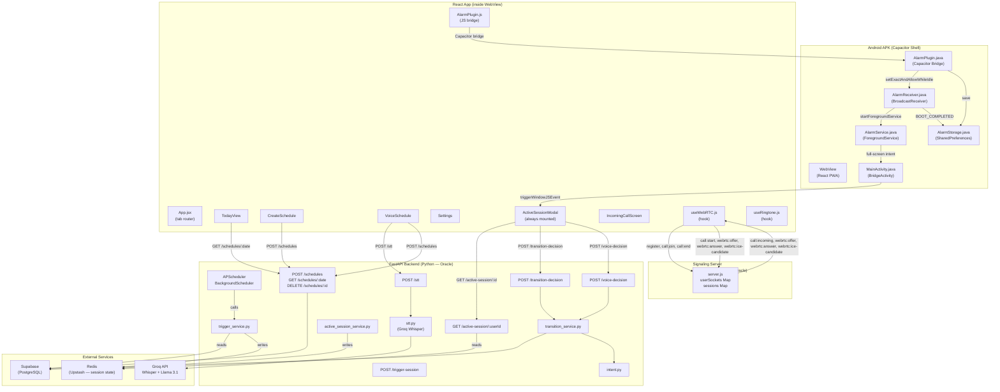

# VocaFlow — Complete Architecture Audit

> **Status:** Read-only audit. No code was modified.
> **Date:** 2026-06-05 | **Auditor:** Antigravity AI

---

## 1. High-Level Architecture Diagram



---

## 2. Folder-by-Folder Explanation

### `vocaflow/` (root)
| File | Purpose |
|---|---|
| `CLAUDE.md` | Master project brief — tech stack, feature spec, DB schema, critical rules |
| `CLAUDE.local.md` | Developer-local overrides (gitignored) — not populated yet |
| `REVIEW.md` | Pre-commit review checklist Claude reads before every `/review` |

---

### `frontend/`

#### `frontend/src/App.jsx`
The root React component. Tab-based router with 4 views: **Today / + New / Voice / Settings**. On mount, calls `requestAlarmPermissions()` to trigger Android system dialogs for battery exemption and exact-alarm permission. `ActiveSessionModal` is **always mounted** — it never unmounts, so the WebRTC socket and polling stay live across all tabs.

> ⚠️ `USER_ID` is hardcoded as a placeholder UUID — auth is not yet wired up.

#### `frontend/src/config.js`
Exports `API_URL` and `SOCKET_URL`. Falls back to a hardcoded LAN IP (`192.168.1.5`) if env vars are absent. This works for local dev but **will break in production** without proper env setup.

#### `frontend/src/components/`

| Component | Responsibility |
|---|---|
| `TodayView` | Fetches and renders today's schedule list from backend. Handles delete. |
| `CreateSchedule` | Manual schedule form (task name, date, time, duration, break, contact mode). Submits to `POST /schedules`, then calls `scheduleNativeAlarm()` for Android alarm. |
| `VoiceSchedule` | 4-step guided voice entry (task name → start time → duration → break). Each step: hold-to-record → POST /stt → parse spoken text → pre-fill field. Client-side parsing for time and duration. Has review + confirm screen. |
| `ActiveSessionModal` | **Core session modal, always mounted.** Polls `GET /active-session/:id` every 5 s. On active session: initiates WebRTC call via `startCall()`. Renders `IncomingCallScreen` when ringing. On accept: opens session popup, auto-records 5 s of voice, sends to `POST /voice-decision`, interprets intent. Handles completed / extend / skip decisions. 30-second auto-reject timer. |
| `IncomingCallScreen` | Full-screen takeover card with pulsing icon. Accept / Reject buttons. Pure presentational — no logic. |
| `Settings` | Stores global contact preference (`call` / `notification`) in **localStorage only**. NOT synced to backend. |

#### `frontend/src/hooks/`

| Hook | Responsibility |
|---|---|
| `useWebRTC.js` | Manages dual-socket WebRTC call lifecycle. **userSocket** = permanent, callee side, registered with userId. **systemSocket** = ephemeral caller side, created per call. Exposes: `callState`, `incomingSessionId`, `connectedCount`, `startCall()`, `acceptCall()`, `hangUp()`. One STUN server: `stun:stun.l.google.com:19302`. |
| `useRingtone.js` | Synthesises dual-tone ringtone (480 Hz + 620 Hz) via Web Audio API. No audio file needed. Loops until stopped. Also calls `navigator.vibrate()` for Android. Has singleton AudioContext to avoid browser warnings. |

#### `frontend/src/services/`

| Service | API calls |
|---|---|
| `schedulesApi.js` | `GET /schedules/:date`, `POST /schedules`, `DELETE /schedules/:id` |
| `sessionApi.js` | `GET /active-session/:userId`, `POST /transition-decision`, `POST /voice-decision` |
| `sttApi.js` | `POST /stt` (multipart form, returns `{ text }`) |

#### `frontend/src/plugins/AlarmPlugin.js`
JS bridge to the native `AlarmPlugin` Capacitor plugin. No-ops on web/iOS. Key functions:
- `requestAlarmPermissions()` — opens battery optimisation + exact-alarm dialogs
- `scheduleNativeAlarm(schedule)` — parses date+time, calls native `scheduleAlarm({ taskName, scheduleId, triggerAtMs })`
- `cancelNativeAlarm(scheduleId)` — cancels via native bridge
- `dismissNativeAlarm()` — stops ringing AlarmService

---

### `signaling/server.js`
Node.js + Socket.io signaling server. Stateful in-memory maps:
- `userSockets: Map<userId → socketId>` — only latest connection per user
- `sessions: Map<sessionId → { callerId, calleeId, room }>` — active calls

**Socket events handled:**

| Event (Inbound) | Action |
|---|---|
| `register` | Store userId→socketId, evict stale socket |
| `call:start` | Create room, notify callee (or emit `call:callee_offline`) |
| `call:join` | Callee joins room, notify caller via `call:callee_joined` |
| `webrtc:offer` | Relay SDP offer to room |
| `webrtc:answer` | Relay SDP answer to room |
| `webrtc:ice-candidate` | Relay ICE candidate to room |
| `call:end` | Clean up session, emit `call:ended` to peers |
| `disconnect` | Clean up user registration, end any active sessions |

---

### `backend/`

#### `backend/main.py`
FastAPI app entry point. Registers 7 routers. Starts APScheduler on startup. CORS allows: localhost, Capacitor origins, LAN IP, and `CLIENT_URL` env var.

#### `backend/db.py`
Singleton Supabase client. Uses `SUPABASE_SERVICE_KEY` (service role — bypasses RLS).

#### `backend/redis_client.py`
Singleton Redis client using `REDIS_URL`. Targeted at Upstash. Smoke-tests on init.

#### `backend/utils.py`
`parse_datetime(date_str, time_str)` — combines strings into timezone-aware datetime (Asia/Kolkata). Raises `ValueError` if in the past.

#### Routers:

| Router | Endpoint(s) | Purpose |
|---|---|---|
| `schedules.py` | `POST/GET/PUT/DELETE /schedules` | CRUD + auto-APScheduler registration + copy-previous |
| `session_logs.py` | `POST/GET /session-logs` | Insert log with mood detection, shift next schedule on extend |
| `transition.py` | `POST /transition-decision` | Handle completed/extend/skip decision after session |
| `trigger.py` | `POST /trigger-session` | Manual trigger endpoint (for testing/admin) |
| `active_session.py` | `GET /active-session/:userId` | Frontend polling — returns Redis session |
| `voice_decision.py` | `POST /voice-decision` | STT + intent parse (no DB write — returns intent only) |
| `stt.py` | `POST /stt` | Groq Whisper transcription (schedule or general context) |

#### Services:

| Service | Responsibility |
|---|---|
| `scheduler.py` | **Primary scheduler** — APScheduler with `date` trigger (fires once). Loaded on startup from Supabase. `_TEST_DELAY_SECS` debug override. |
| `scheduler_service.py` | **Duplicate/legacy scheduler** — APScheduler with `cron` trigger. Same logic, different trigger type. Both exist in codebase. Only `scheduler.py` is used by `main.py`. |
| `active_session_service.py` | Store/get/extend/clear sessions in Redis. TTL = 90 min. |
| `trigger_service.py` | Fetch schedule from Supabase, write to Redis, return payload. |
| `transition_service.py` | Insert session_log to Supabase, shift next schedule on extend, process voice decisions. |
| `intent.py` | STT correction + fuzzy matching → `{ intent, duration, low_confidence }` |
| `redis_service.py` | Raw Redis primitives: set/get/update/delete with JSON serialization. |
| `stt.py` | Groq Whisper API call. |

---

## 3. Data Flow: Scheduling a Call to Phone Ringing

```
USER ACTION: Creates a task for 10:00 AM
       │
       ▼
CreateSchedule.jsx
  → POST /schedules (FastAPI)
       │
       ├── Supabase INSERT → schedules table
       │
       ├── APScheduler.add_job(
       │     func=_run_trigger,
       │     trigger="date",
       │     run_date=10:00:00+05:30,
       │     id="session_{id}"
       │   )
       │
       └── scheduleNativeAlarm({ taskName, scheduleId, triggerAtMs })
             → AlarmPlugin.java.scheduleAlarm()
             → AlarmManager.setExactAndAllowWhileIdle(RTC_WAKEUP, 10:00)
             → AlarmStorage.save(scheduleId, taskName, triggerAtMs)

━━━━━━━━━━━━━━━━━━━━━━━━━━━━━━━━━━━━━━━━━━━━━━━━
AT 10:00 AM — TWO PARALLEL PATHS FIRE
━━━━━━━━━━━━━━━━━━━━━━━━━━━━━━━━━━━━━━━━━━━━━━━━

PATH A: APScheduler (backend — app is running)
  APScheduler thread fires _run_trigger()
       │
       ├── trigger_service.trigger_session(userId, scheduleId)
       │     └── Supabase SELECT schedules WHERE id=scheduleId
       │         redis_service.set_session(scheduleId, {...})
       │
       └── active_session_service.store_session(userId, scheduleId, task)
             └── redis_service.set_session(userId, { task, status:"active", ... })

                           │
                    [Frontend polls every 5s]
                           │
       ActiveSessionModal: GET /active-session/{userId}
                           │
                    returns { active: true, data: { task, schedule_id } }
                           │
                    startCall(schedule_id)
                           │
                    systemSocket.emit("call:start", { session_id, callee_user_id })
                           │
                    Signaling Server → userSocket.emit("call:incoming", { session_id })
                           │
                    callState → "ringing"
                    useRingtone.startRinging() ← Web Audio API tones + vibration
                    IncomingCallScreen renders

PATH B: Android Alarm (works when backend is unreachable / app background)
  AlarmManager fires → AlarmReceiver.onReceive("ALARM_FIRE")
       │
       └── AlarmService.startForeground(NOTIF_ID, notification)
             ├── Ringtone.play() (system alarm sound, max volume)
             ├── Vibrator.vibrate(pattern, repeat)
             ├── Notification with full-screen intent
             └── Auto-dismiss after 60 s
                   │
             User taps notification → MainActivity.onNewIntent()
                   │
             checkIntentForAlarm() detects fromAlarm=true
                   │
             bridge.triggerWindowJSEvent("vocaflow:incoming_call", { scheduleId })
                   │
             ActiveSessionModal event listener → force-poll → PATH A continues
```

---

## 4. Authentication Flow

> ⚠️ **Authentication is NOT implemented.** This is a critical production gap.

Current state:
- `USER_ID` is hardcoded in `App.jsx` as `'00000000-0000-0000-0000-000000000001'`
- All API calls pass this static UUID as `user_id`
- Supabase uses **service role key** (bypasses RLS entirely)
- No login screen, no session token, no JWT
- `users` table exists in schema but is only auto-upserted on schedule create

The planned auth system per CLAUDE.md is **not implemented** in any file.

---

## 5. Supabase Usage Map

| Table | Operations | Where |
|---|---|---|
| `users` | `UPSERT` on conflict=id | `schedules.py → create_schedule()` |
| `schedules` | `INSERT` | `schedules.py → create_schedule()` |
| `schedules` | `SELECT WHERE date=today` | `scheduler.py → _load_todays_sessions()` |
| `schedules` | `SELECT WHERE id=schedule_id` | `trigger_service.py → trigger_session()` |
| `schedules` | `SELECT WHERE id=schedule_id` + `SELECT next by start_time` | `transition_service.py → shift_next_schedule()` |
| `schedules` | `UPDATE start_time` (next schedule only) | `transition_service.py → shift_next_schedule()` |
| `schedules` | `SELECT WHERE date=date AND user_id=user_id` | `schedules.py → get_schedules_for_date()` |
| `schedules` | `DELETE WHERE id=schedule_id` | `schedules.py → delete_schedule()` |
| `schedules` | `SELECT yesterday` + `INSERT copied rows` | `schedules.py → copy_previous_schedule()` |
| `session_logs` | `INSERT` (with mood signal) | `session_logs.py`, `transition_service.py` |
| `session_logs` | `SELECT WHERE user_id` | `session_logs.py` |
| `session_logs` | `SELECT WHERE user_id + date range` | `session_logs.py` |

**Tables declared in CLAUDE.md but NOT yet implemented:**
- `daily_summaries` — no router, no service, no Groq summary job
- `weekly_summaries` — same

**Supabase client:** Uses `SUPABASE_SERVICE_KEY` (service role). No RLS policies matter since service key bypasses them. This is intentional for MVP but a **security risk in production**.

---

## 6. WebRTC / Signaling Flow

### Architecture Decision: Dual-Socket Pattern
The signaling server uses `socket.to(room)` which **excludes the sender**. A single socket cannot be both caller and callee. The solution: two Socket.io connections per call:
- **userSocket** — permanent, registered with userId → callee role
- **systemSocket** — ephemeral per call → caller role

### Full Signaling Sequence

```
Frontend (systemSocket)          Signaling Server           Frontend (userSocket)
        │                               │                           │
        │──call:start ──────────────────►│                          │
        │  { session_id, callee_id }     │──call:incoming──────────►│
        │                               │  { session_id }           │ (callState = 'ringing')
        │                               │                           │──call:join──────────►
        │◄──call:callee_joined ──────────│◄─────────────────────────│
        │                               │                           │
        │ create RTCPeerConnection       │                           │ create RTCPeerConnection
        │ createOffer()                  │                           │ setRemoteDesc(offer)
        │──webrtc:offer────────────────►│──────────────────────────►│
        │                               │                           │ createAnswer()
        │◄──webrtc:answer───────────────│◄──────────────────────────│
        │ setRemoteDesc(answer)          │                           │
        │ ICE candidates exchanged bidirectionally via webrtc:ice-candidate
        │                               │                           │
        │════════ P2P Audio Stream ════════════════════════════════ │
```

### ICE Configuration
Only Google's public STUN server is used:
```js
{ iceServers: [{ urls: 'stun:stun.l.google.com:19302' }] }
```
> ⚠️ **No TURN server** — calls will fail when both peers are behind symmetric NAT (corporate networks, some mobile carriers).

### Callee Offline Handling
If `userSocket` is not registered when `call:start` arrives:
- Signaling server emits `call:callee_offline` back to caller
- Frontend logs a warning and calls `cleanup()` — **no fallback to push notification is implemented** (REVIEW.md specifies it should fall back, but code does not)

---

## 7. Android Background Execution Flow

```
App Launch (first time)
  App.jsx useEffect → requestAlarmPermissions()
    → AlarmPlugin.java.requestAlarmPermissions()
      → Opens "Disable battery optimisation" dialog
      → Opens "Alarms & reminders" permission dialog (Android 12+)

User Creates Schedule
  CreateSchedule.jsx / VoiceSchedule.jsx
    → POST /schedules (FastAPI registers APScheduler job)
    → scheduleNativeAlarm(schedule)
      → AlarmPlugin.java.scheduleAlarm()
        → AlarmManager.setExactAndAllowWhileIdle(RTC_WAKEUP, triggerAtMs)
        → AlarmStorage.save(scheduleId, taskName, triggerAtMs)

At Scheduled Time (alarm fires)
  AlarmReceiver.onReceive(ACTION="com.vocassistant.app.ALARM_FIRE")
    → Context.startForegroundService(AlarmService)
      → AlarmService.onStartCommand(ACTION_FIRE)
        → createNotificationChannel()
        → startForeground(NOTIF_ID, notification)
          - setFullScreenIntent → opens MainActivity if screen locked
          - CATEGORY_ALARM, PRIORITY_MAX, VISIBILITY_PUBLIC
          - "Dismiss" action button → ACTION_DISMISS
        → RingtoneManager.getRingtone(TYPE_ALARM).play()
        → Vibrator.vibrate(pattern, repeat=0)
        → Thread.sleep(60_000) → dismissAndStop() [auto-dismiss]

User Taps Notification
  MainActivity.onNewIntent(intent)
    → checkIntentForAlarm() detects fromAlarm=true
    → bridge.triggerWindowJSEvent("vocaflow:incoming_call", { scheduleId })
    → ActiveSessionModal event listener fires
    → Force-polls GET /active-session/{userId}
    → WebRTC call flow begins

Device Reboot
  AlarmReceiver.onReceive(ACTION="BOOT_COMPLETED" or "LOCKED_BOOT_COMPLETED")
    → AlarmStorage.loadAll(context)
      → For each future alarm: AlarmManager.setExactAndAllowWhileIdle(...)
      → For each past alarm: AlarmStorage.remove(...)
```

---

## 8. Existing Permissions Used

| Permission | Where Declared | Purpose |
|---|---|---|
| `INTERNET` | Manifest | WebView, API calls, WebRTC |
| `RECORD_AUDIO` | Manifest | Microphone for WebRTC + STT |
| `MODIFY_AUDIO_SETTINGS` | Manifest | Set alarm volume |
| `SCHEDULE_EXACT_ALARM` | Manifest | Android 12+ exact alarms (user must grant) |
| `USE_EXACT_ALARM` | Manifest | Android 13+ exact alarms (auto-granted for alarm apps) |
| `WAKE_LOCK` | Manifest | Keep device awake during alarm |
| `REQUEST_IGNORE_BATTERY_OPTIMIZATIONS` | Manifest | Request Doze bypass |
| `RECEIVE_BOOT_COMPLETED` | Manifest | Reschedule alarms on reboot |
| `FOREGROUND_SERVICE` | Manifest | Run AlarmService as foreground |
| `FOREGROUND_SERVICE_MEDIA_PLAYBACK` | Manifest | `foregroundServiceType="mediaPlayback"` |
| `USE_FULL_SCREEN_INTENT` | Manifest | Lock screen takeover |
| `POST_NOTIFICATIONS` | Manifest | Android 13+ notification permission |
| `VIBRATE` | Manifest | Vibration |

**Runtime permissions requested by code:**
- Microphone — via `navigator.mediaDevices.getUserMedia()` (Web API)
- Battery optimization exemption — via `Settings.ACTION_REQUEST_IGNORE_BATTERY_OPTIMIZATIONS`
- Exact alarm — via `Settings.ACTION_REQUEST_SCHEDULE_EXACT_ALARM`

---

## 9. Potential Production Risks

### 🔴 Critical

| Risk | Details |
|---|---|
| **No authentication** | `USER_ID` is hardcoded. Any user can read/modify any other user's data. Supabase service key bypasses RLS. |
| **No TURN server** | WebRTC calls will fail over cellular/corporate NAT. Only Google STUN is configured. |
| **Hardcoded LAN IP** | `config.js` falls back to `192.168.1.5`. Will fail in production builds unless `VITE_API_URL` is set. |
| **`androidScheme: "http"`** | Capacitor config uses HTTP (not HTTPS). Required for LAN dev but leaks data in production. |
| **`allowBackup: true` + `usesCleartextTraffic: true`** | Backup enables data extraction by other apps. Cleartext traffic allows MITM on non-TLS connections. |

### 🟡 Significant

| Risk | Details |
|---|---|
| **Duplicate scheduler files** | `scheduler.py` (date trigger, one-shot) and `scheduler_service.py` (cron trigger, repeating) both exist. Only `scheduler.py` is active. `scheduler_service.py` is dead code that could cause confusion. |
| **Redis single point of failure** | Active session state lives only in Redis. If Upstash connection fails, `GET /active-session` returns `{ active: false }` silently — call never initiates. No fallback or circuit breaker. |
| **Settings not synced to backend** | Contact preference is stored in `localStorage` only. Switching devices loses the preference. The `users.contact_default` DB field is never read or written by the frontend. |
| **Auto-reject race condition** | 30-second auto-reject timer in `ActiveSessionModal` uses `eslint-disable-line react-hooks/exhaustive-deps` — intentionally captures stale closures. Could fire on wrong session if user dismisses and new session arrives within 30 s. |
| **No DTMF implementation** | CLAUDE.md describes DTMF-based voice scheduling (press 1-5 for steps). The VoiceSchedule component uses touch-based hold-to-record instead. DTMF detection (`dtmf.py`) is listed in CLAUDE.md but the file does not exist in the codebase. |
| **No Groq summary jobs** | `groq_summary.py` and the daily/weekly summary scheduler are listed in CLAUDE.md but do not exist. `daily_summaries` and `weekly_summaries` tables have no implementation. |
| **No push notification fallback** | When callee is offline (`call:callee_offline`), the frontend only logs a warning. No push notification is sent. |
| **STT prompt mismatch** | `services/stt.py` has a prompt for session decisions ("extend, completed, skip"). `routers/stt.py` has a different prompt for schedule creation ("task names, times, durations"). The service-level prompt is always overridden by the router-level prompt — the service default is never used. |
| **`AlarmPlugin.java.dismissAlarm()`** | Calls `startService()` not `startForegroundService()`. On API 26+, this may cause a `ForegroundServiceStartNotAllowedException` if called from background. |
| **Extension shift is not atomic** | `shift_next_schedule` shifts only the **immediately next** schedule. If multiple subsequent sessions exist, they all overlap. CLAUDE.md requires cascading shifts. |

### 🟢 Minor / Code Quality

| Issue | Details |
|---|---|
| **Debug `print()` throughout backend** | Extensive `print()` statements remain in scheduler, trigger, redis, and utils. Should be replaced with `logger.debug()` before production. |
| **`session_id` vs `schedule_id` confusion** | `active_session_service.store_session` uses `user_id` as the Redis key, but `trigger_service` also stores a second key using `schedule_id`. Two Redis keys per session. |
| **`_TEST_DELAY_SECS = 0`** | Debug flag is in production code. Risk of being accidentally set to non-zero on deploy. |
| **No error boundary** | React app has no `ErrorBoundary`. An unhandled error in `ActiveSessionModal` (which is always mounted) would crash the entire app. |
| **TodayView delete silently fails** | `handleDelete` catches all errors and does nothing — the item stays in the list with no user feedback. |
| **`misfire_grace_time = 60`** | If FastAPI restarts within 60 s of a scheduled session, APScheduler may fire the job late. This is intentional but could cause double-triggers if the server crashes and restarts. |

---

## 10. Missing Features Required for Play Store Readiness

### Absolute Requirements (Blockers)

| Missing | Why Required |
|---|---|
| **User Authentication** | Without auth, the app cannot be multi-user or secure. Play Store TOS requires user data protection. |
| **HTTPS everywhere** | `androidScheme: "http"` must be changed to `"https"`. All API/signaling endpoints must use TLS. `usesCleartextTraffic: true` must be removed. |
| **Privacy Policy URL** | Play Store requires a privacy policy for any app that accesses microphone. |
| **TURN server** | Without TURN, calls fail on most real-world networks. Service like Twilio TURN / Metered.ca required. |
| **Notification permission runtime request** | `POST_NOTIFICATIONS` is declared but not runtime-requested in JS/Java. On Android 13+, the notification may silently not appear. |
| **`applicationId` matching** | `capacitor.config.json` uses `com.vocassistant.app` but app name is `vocassistant`. The Play Console listing and bundle ID must match consistently. |

### High Priority

| Missing | Details |
|---|---|
| **Multi-user support** | Currently single-user with hardcoded UUID |
| **Push notification fallback** | When WebRTC call fails or user is offline, Web Push / FCM must be sent |
| **FCM (Firebase Cloud Messaging)** | Required for reliable background notifications on Android when the app is fully killed |
| **Offline/airplane mode handling** | No graceful degradation when backend is unreachable |
| **Contact preference backend sync** | Settings must persist to `users.contact_default` in Supabase |
| **Groq daily/weekly summaries** | The entire AI summary pipeline is defined but not built |
| **App store assets** | Launcher icon is `ic_launcher` placeholder. Needs production icon, feature graphic, screenshots |
| **Proguard / R8 rules** | `proguard-rules.pro` is default empty template — JSON/reflection used in AlarmStorage may be stripped |
| **Target API level** | Must target API 35 (Android 15) for new Play Store submissions in 2025+ |
| **Content rating** | Play Store requires content rating questionnaire completion |
| **`android:allowBackup="false"`** | Should be false for security — sensitive alarm schedules would otherwise be backed up |

### Medium Priority

| Missing | Details |
|---|---|
| **Error boundary in React** | Required for production stability |
| **WebRTC connection state UI** | `oniceconnectionstatechange` / `onconnectionstatechange` not handled with user-facing feedback |
| **Scheduled task for tomorrow** | `_load_todays_sessions()` only runs on startup. Tasks created for tomorrow are scheduled at startup next day — but if the backend is restarted mid-day, tomorrow's tasks that were created today are not re-registered |
| **Schedule date beyond today** | Frontend lets user pick future dates. Backend `create_schedule()` skips APScheduler for non-today dates. AlarmPlugin handles this with `triggerAtMs` but backend scheduler doesn't |
| **Graceful reconnect for APScheduler jobs** | If a schedule is deleted while its APScheduler job is pending, `remove_session_job()` is not called from the delete route |
| **DTMF flow** | Described in spec, completely unimplemented |
| **Unit tests** | Backend `pytest` support exists but no test files exist beyond `test_redis_service.py` |
| **Vitest for frontend** | Mentioned in CLAUDE.local.md but no test files exist |
